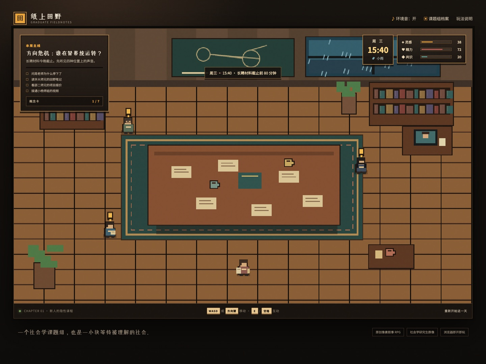
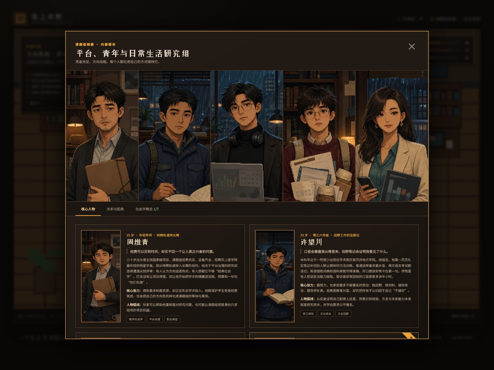

# 纸上田野 · 组会生存志

一个原创的浏览器像素叙事 RPG Demo。玩家扮演以第一名入学的社会学硕士生沈砚，在长聘材料截止前探索课题组办公室，理解一群聪明、努力、疲惫又彼此依赖的人。

## 试玩

直接打开 `index.html`，或在项目目录启动任意静态文件服务器。游戏无需构建、数据库或第三方 JavaScript 依赖。

- `WASD` / 方向键：移动
- `E` / 空格：互动、继续对话
- 支持触屏方向键和互动按钮

## 核心人物

- 周维青：经费充足、刚从特聘轨道转入长聘，却因研究方向受挫而失去投入感的年轻导师。
- 许望川：院校出身普通、带浓重乡音、英语能写难读，但以长期田野和关系能力支撑课题组的大师兄。
- 邵亦辰：聪明而松弛，用计算社会学能力承接行业咨询、为自己购买职业选择权的二师兄。
- 沈砚：专业第一名入学，却先从打印、报销与咖啡开始学习学术隐性课程的玩家角色。
- 杨知夏：毕业后在行业内极具影响力，能够连接研究与决策，同时坚持合作边界的小杨师姐。

## Demo 已包含

- 可探索的像素风组会室
- 五位核心人物的完整小传、核心张力与成长线
- 四位核心 NPC 的分支对话与一名玩家角色
- 灵感、精力、共识三项状态
- “谁在替系统运转？”主线任务与三个结局
- 七张可解锁社会学概念卡：隐性课程、语言资本、学术资本主义、场域与投入感、边界工作、隐形劳动、研究反身性
- 制度性配角与关系档案；院长、行政秘书和匿名评审只触发压力事件，不挤占群像主线
- 桌面、移动端响应式界面
- 原创 AI 辅助概念场景与代码绘制的游戏内像素素材
- GitHub Pages 静态托管结构

## 后续适合扩展

下一阶段可以把当前序章扩为一个完整学年：长聘评估、田野进入、行业合作、署名冲突、开题与投稿。每条剧情都让人物关系与社会学概念同时推进，而不是把知识做成脱离人物的考试题。

## 版权说明

本项目只借鉴经典生活模拟 RPG 的“日程、探索与关系”类型结构，不包含或复制《星露谷物语》的代码、美术、音乐、角色、地图或文本。所有 Demo 角色、剧情与界面均为原创。
